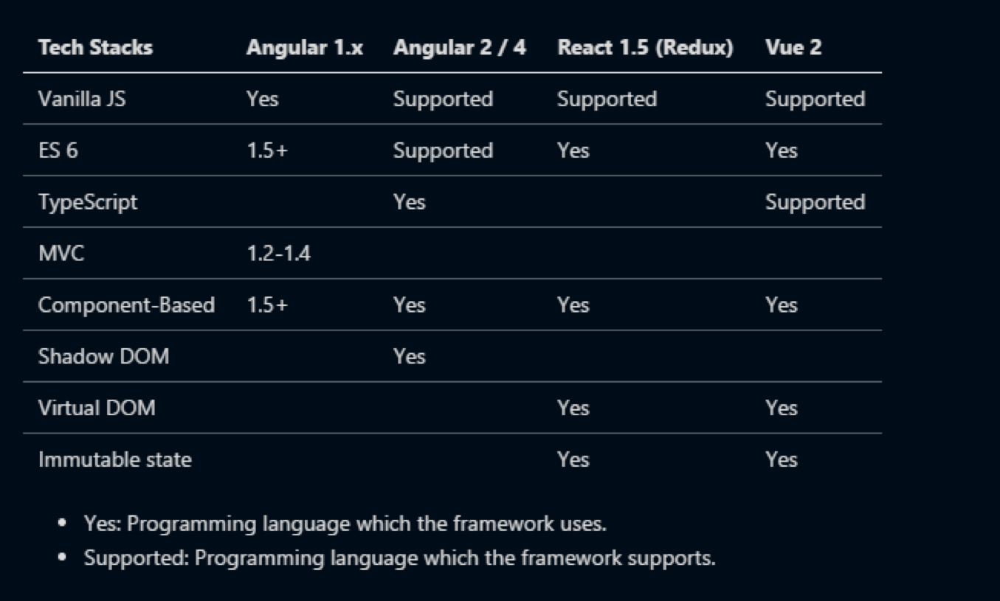
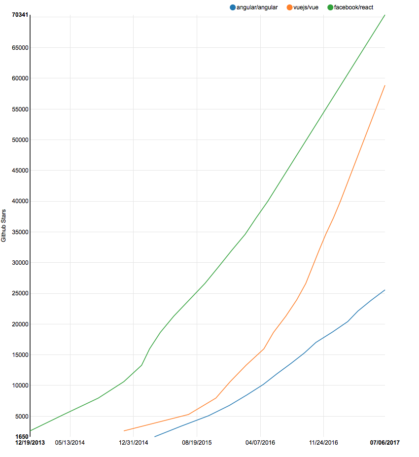
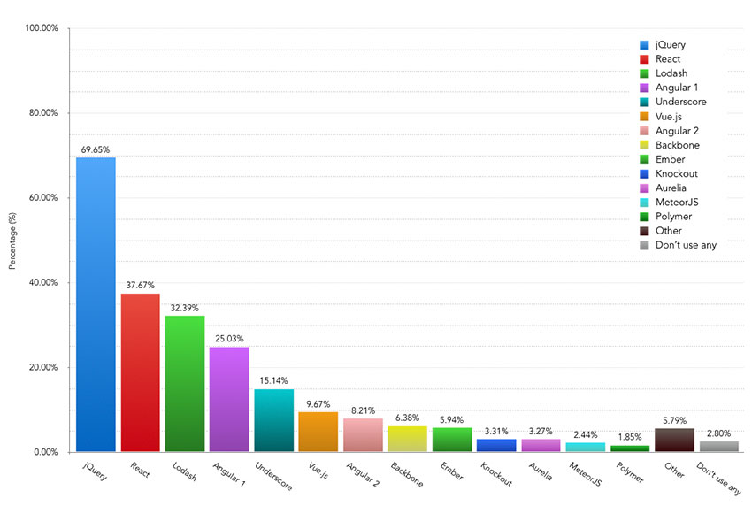
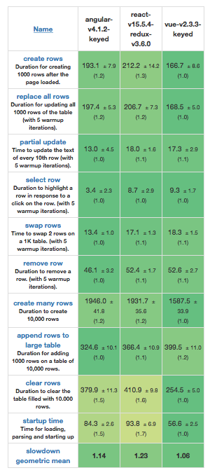
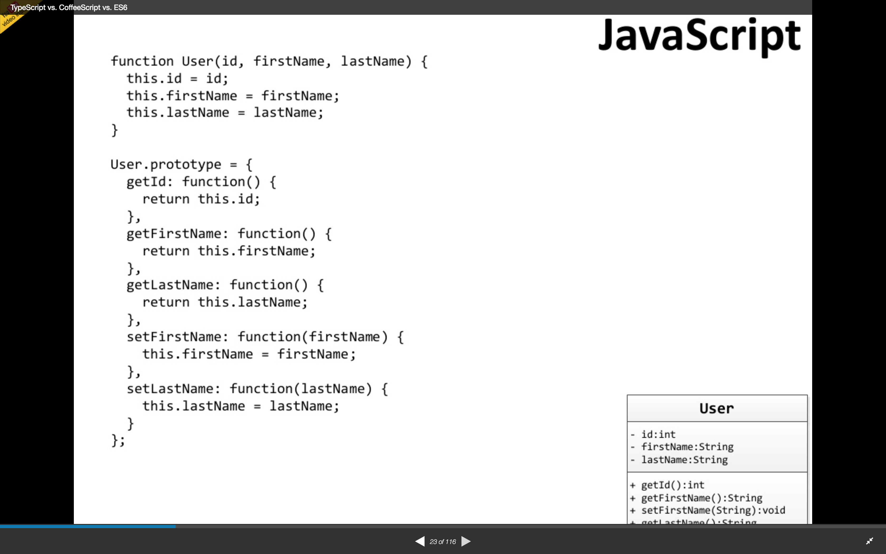
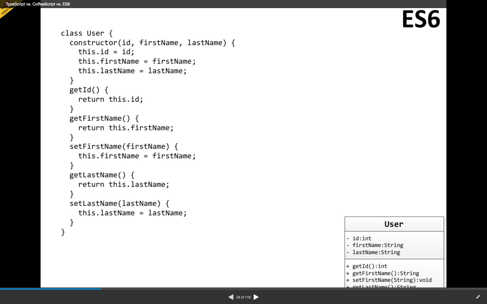
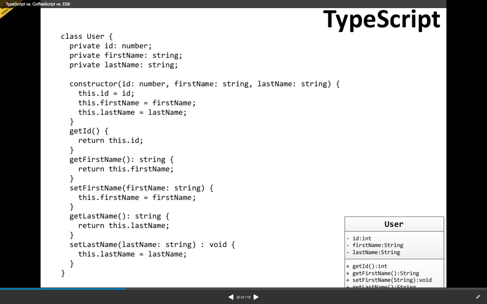

# [Comparison Front-End](https://github.com/Seolhun/compare-frontframework)
- Author : [SeolHun](https://github.com/Seolhun)
- Date : 2017.10.11
---

### Content
#### 1. Angular vs React vs Vue


---
##### - TypeScript란?
1. 대형 자바스크립트 어플리케이션에 적합한 언어
2. TypeScript 컴파일러를 통해 JavaScript로 변환 > 디버깅 가능
3. 자바스크립트 라이브러리의 동작 방식과 충돌하지 않는다. (타입 > 자바스크립트)
4. 추가된 타입 체계 및 문법 강제 (any, ===)
5. ES5(ECMAScript 5) 문법의 상위 집합


##### - DOM
- Shadow DOM
	Shadow DOM은 웹 컴포넌트 표준의 일부이며 DOM 트리 및 스타일 캡슐화를 가능하게합니다. 
	기본적으로 Shadow DOM은 우리가 다른 요소 뒤에 DOM 로직을 숨길 수 있음을 의미합니다. 또한, 외부 세계로 출혈하지 않고 스코프 스타일을 요소에 적용 할 수 있습니다.

- Virtual DOM
	표준은 아니지만 표준 DOM에서 차선책으로 사용되고 있다.
	Virtual DOM은 DOM 직접 건드리기 보다 우리는 이것의 추상화된 버전을 만든다.
	이는 가상 DOM에 수정하고 실제 DOM에 적용할 수 있으며, 실제 DOM에 적용하기 전에 바뀐 부분이 있는지 비교한 후에 적용할 수 있다.
	렌더링 비용이 큰 부분들이 전부 필요하지 않기 때문에 직접 DOM을 핸들링하는것 보다 훨씬 빠르다. 
	좋은 방법이지만 올바르게 사용해야 한다.
		1. “언제 DOM을 다시 렌더링 할것인가?”
		2. “어떻게 효율적으로 할 것인가?”

	데이터가 바뀌면 업데이트할 필요가 있다. 하지만 데이터가 바뀌었는지 어떻게 알까?
	두가지 방법이 있다. 
		1. 첫번째 방법, 간단히 생각해서(dirty checking) 데이터의 모든 값을 체크하는 것이다.
		2. 두번째 방법, 상태(state)가 바뀌는지 관찰(observe)하고 있는것이다. 만약 바뀐게 없다면 아무것도 하지 않으면 된다. 만약 바뀌었다면 무엇을 업데이트 해야할지 알게 된다.

		- 가상 DOM 을 실제로 빠르게 하는 것은 무었인가?
		1. 효과적인 비교 알고리즘.
		2. DOM을 읽고 쓰는 작업
		3. 효율적으로 서브 트리만 업데이트하는 것.
	
---
##### 2. Component-Based란?
- 자바스크립트에서 모듈 패턴을 주로 사용하였는데, 모듈패턴읩 방식이 현재의 Front Library Component와 비슷한 형태를 가지고 있습니다.
- [JS - Module Pattern](https://toddmotto.com/mastering-the-module-pattern/)
1. Module 구성을 강제함으로서 코드 구조의 통일성 및 간결함 제공
2. 객체지향의 특성을 갖추게 도와주며 재사용성을 높여줍니다.
3. Write (Components) once, Use Anywhere


##### - Code Example 
1. [AngualrJS - Component](https://docs.angularjs.org/guide/component)
- AngularJS에서 컴포넌트(Component)는 컴포넌트 기반 응용 프로그램 구조에 적합한 간단한 구성을 사용하는 특별한 종류의 지시문입니다.

- AngualrJS 1.5 ~ (Component)
```html
<div ng-app="myApp"> 
	<hello-world name="AngualrJS Template" > </hello-world>
</div>
```

```javascript
angular.module("myApp", [])
.component("helloWorld", {
	template: "<h1>Home</h1><p>Hello, {{$ctrl.name}}, I'm {{$ctrl.myName}}</p>",
	bindings: { name: '@' },
	controller: function(){
		this.myName = 'Alain';
	}
});
```


---
2. [VueJS - Component](https://kr.vuejs.org/v2/guide/components.html)
- 컴포넌트(Component)는 Vue의 가장 강력한 기능 중 하나입니다. 기본 HTML 엘리먼트를 확장하여 재사용 가능한 코드를 캡슐화하는 데 도움이 됩니다. 상위 수준에서 컴포넌트는 Vue의 컴파일러에 의해 동작이 추가된 사용자 지정 엘리먼트입니다. 경우에 따라 특별한 is 속성으로 확장 된 원시 HTML 엘리먼트로 나타날 수도 있습니다.

```html
<div id="example">
	<my-component :name="name"></my-component>
</div>
```

```javascript
Vue.component('my-component', {
	props: ['name'],
	template: '<div><h1>Home</h1><p>Hello, {{ name }}</div>',
})	

new Vue({
	el: '#example',
	data: {
		name: 'VueJs Template'
	},
	methods: {},
	computed: {},
	watch: {}
})
```


---
3. [ReactJS - Component](https://reactjs.org/docs/components-and-props.html)
- 컴포넌트(Component)는 출력에서 다른 컴포넌트를 참조 할 수 있습니다. 이를 통해 모든 세부 수준에서 동일한 컴포넌트 추상화를 사용할 수 있습니다. 버튼, 양식, 대화 상자, 화면 : React 앱에서 모든 것은 일반적으로 컴포넌트로 표현됩니다.

```html
<div id="container">
    <!-- This element's contents will be replaced with your component. -->
</div>
```

```javascript
class Hello extends React.Component {
  render() {
    return <div>Hello {this.props.name}</div>;
  }
}

ReactDOM.render(
  <Hello name="ReactJS Template" />,
  document.getElementById('container')
);
```


---
##### - 현재 Github Stars


##### - 현재 Contributor들의 커밋상황
[AngularJS Contributor](https://github.com/angular/angular.js/graphs/contributors)
[VueJS Contributor](https://github.com/vuejs/vue/graphs/contributors)
[ReactJS Contributor](https://github.com/facebook/react/graphs/contributors)

##### - JS 사용비율



---
#### 2. Main point to comparison
##### 1. Performance


[Source](http://www.stefankrause.net/js-frameworks-benchmark6/webdriver-ts-results/table.html)
- 뷰가 가장 빠르지만, 대부분의 프레임워크의 선택함에 있어 성능은 크게 중요하지 않다.(큰 차이가 없다.)


##### 2. Recruting(HR)
- JSX란? (React JS)
Javascript + XML을 합쳐서 탄생한 기존 자바스크립트의 확장 문법입니다.
개발자가 자바스크립트 내부에 마크업 코드를 작성해 줄 수 있게 해줍니다.
단순히 XML만 아니라 변수나 프로퍼티의 바인딩 기능도 제공합니다

- HTML(Angualr, Vue)
Vue와 AngularJS의 경우 해당 HTML태그를 통해 다양한 기능을 구현할 수 있습니다.
Javascript를 잘 알지 못하는 디자이너가 디자인을 수정해야 할 경우 React는 적합하지 않습니다.


##### 3. Learning curve(Documentation)
- Vue > React > Angualr

1. 문서화는 Vue > React > Angualr 입니다.
- Vue의 경우 한국어를 지원하며, 깔끔하게 필요한 정보만을 잘 정리하였습니다.
- React와 Angualr의 큰 차이는 없으나, Angualr의 가장 큰 어려움은 버전의 파편화이며, 이에 따른 문서화가 복잡하다는 것입니다.

2. Syntax
- AngualrJS는 고유의 Angualr Syntax가 많아 해당 사용을 익히는데에 대한 시간이 많이 소요됩니다.
- React의 경우는 Javascript의 코드를 거의 강제함으로써 이에 익숙하지 않은 유저에게 적합하지 않습니다.
- Vue의 경우는 기본 Javascript와 닮아 배우기에 간단합니다. 하지만, 앞으로 나아가야 할 길이 많습니다.


##### 4. (Typescript vs ES6 vs ES5)[https://medium.com/@basarat/typescript-won-a4e0dfde4b08]
- If you are writing your code in TypeScript, you are not writing standard JavaScript anymore.
1. 타입스크립트를 작성하면 타입을 통한 유효성 검사가 가능해지며, 어노테이션 및 다양한 문법을 통해 코드의 양을 줄여줍니다.







- Do you mind having a build step?
	- Yes : Use ES5
	- No : keep going

- Do you want to use types?
	- Yes : Use TypeScript
	- No : Use ES6

---
### Conclusion
- Webpack과 같은 Bundler 오픈소스를 통해 Front에 Framework화가 쉽게 진행되었습니다.
Angualr는 자체적인 프레임워크로 성장하여 필요한 Dependencies들에 대한 선택요소를 줄여줍니다. 이와 반대로 React나 Vue와 같은 경우, Bundler를 통해 자유로운 Dependencies들을 선택하여 필요한 기능만을 사용하여 가볍고 유연하게 사용할 수 있습니다.

결론적으로, 
- [Angular](https://stackshare.io/angular-2)
	- 중, 대형 프로젝트
	- 웹 - 앱(NativeScript)
	- TypeScript, ES6 이상을 사용
	- Googler들의 올바른 선택을 믿고 큰 고민없이 기술스택을 고르고 싶을때
	- HTML과 JS함께 기능 제공 - HTML 퍼블리셔와 협업 시(팀 구성시)

- [AngularJS](https://stackshare.io/angularjs)
	- 개인적으로, AngularJS는 현재 업데이트가 거의 멈춘 상태이므로 쓰지 않는 것이 바람직하다고 생각합니다.
	- Angular의 도입으로 현재도 많이 사용되고 있으나, 차후에 버전 마이그레이션 작업이 소요될 것으로 판단.

- [React](https://stackshare.io/react)
	- 중,대형 프로젝트 (Instagram, Facebook 등)
	- 웹과 앱(React Native)
	- 자바스크립트를 통한 UI 코딩(JSX)
	- 스스로 고민하고 기술들을 비교하여 기술스택을 고르고 싶을때
	- JS 개발자 위주 팀 구성(HTML 퍼블리셔 X)
	
- Vue
	- 중소형 프로젝트
	- 웹과 앱(NativeScript)
	- Event Driven에 초점을 맞춘 웹 사이트 구축
	- 스스로 고민하고 기술들을 비교하여 기술스택을 고르고 싶을때
	- HTML과 JS함께 기능 제공 - HTML 퍼블리셔와 협업 시(팀 구성시)
	- Server에 중점적으로 개발하고 Client는 큰 어려움없이 개발해야 할 시

- 마지막으로 좋은 글이 있어 퍼왔습니다.
	- This is an exaggeration, of course, but there is probably a grain of truth to it. 
	Yes, there is a lot of buzzing in the Javascript ecosystem. You’ll probably find a lot of other attractive
	alternatives during your search **-- Try not to be blinded by the newest, shiniest framework.**


---
### Reference
1. Official Homepage
- [Vanilla JS](http://vanilla-js.com/)
- [TypeScript](https://www.typescriptlang.org/)
- [VueJS](https://vuejs.org/)


2. Blog
- [Comparison1](http://blog.jeonghwan.net/vue/2017/03/29/is-vue-better-than-angular-react.html) 
- [Comparison2](https://medium.com/unicorn-supplies/angular-vs-react-vs-vue-a-2017-comparison-c5c52d620176)
- [Comparison3](https://medium.com/@harryho2/angular-vs-react-vs-vue-f470f5b74bf6)
- [Shadow DOM이란](https://blog.thoughtram.io/angular/2015/06/29/shadow-dom-strategies-in-angular2.html)
- [Virtual DOM이란](http://3794.tistory.com/entry/가상-DOM-이란)

