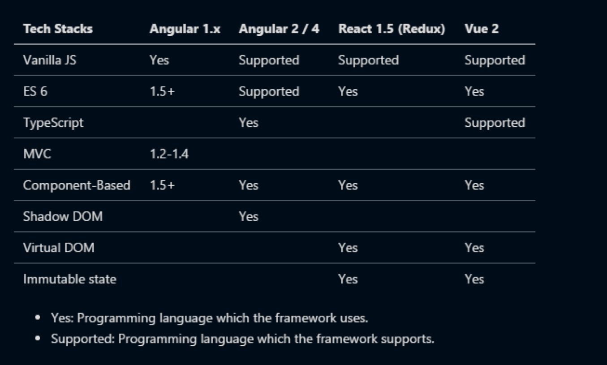
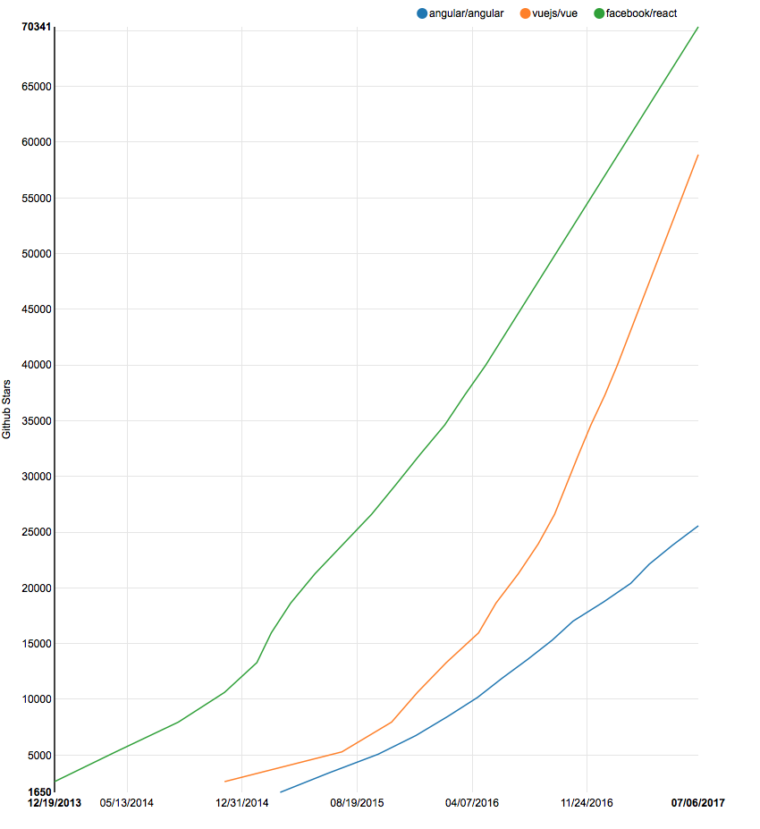
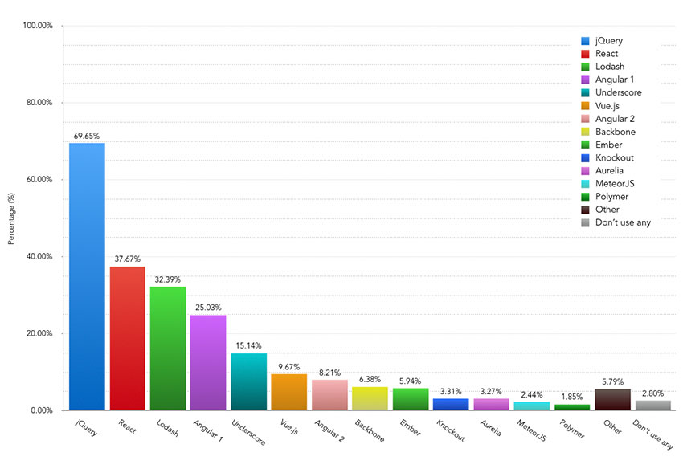

## Comparison Front-End

### Content
#### 1. Angular vs React vs Vue
- 
	- TypeScript란?
		1. 대형 자바스크립트 어플리케이션에 적합한 언어
		2. 기존 소프트웨어 컴포넌트와 자바스크립트 라이브러리의 동작 방식과 충돌하지 않는다.
		3. 동적 모듈 로딩을 지원하여, 네이밍 충돌 문제 해소
		4. 추가된 타입 체계 및 문법 강제 (any, ===)
		5. ES5(ECMAScript 5) 문법의 상위 집합
		6. TypeScript 컴파일러를 통해 JavaScript로 변환 > 디버깅 가능

		[Vanilla JS](http://vanilla-js.com/)
		[TypeScript](https://www.typescriptlang.org/)

	- Component-Based란?
		- [JS - Module Pattern](https://toddmotto.com/mastering-the-module-pattern/)
		1. Module 구성을 강제함으로서 코드 구조의 통일성 및 간결함 제공
		2. 객체지향의 특성을 갖추게 도와주며 재사용성을 높여줌

		1. [AngualrJS - Component](https://docs.angularjs.org/guide/component)
		- AngularJS에서 컴포넌트(Component)는 컴포넌트 기반 응용 프로그램 구조에 적합한 간단한 구성을 사용하는 특별한 종류의 지시문입니다.
		
		```javascript
		var myMod = angular.module('myMod', ['ngRoute']);
		myMod.component('home', {
		  template: '<h1>Home</h1><p>Hello, {{ $ctrl.user.name }} !</p>',
		  controller: function() {
		    this.user = {name: 'world'};
		  }
		});
		myMod.config(function($routeProvider) {
		  $routeProvider.when('/', {
		    template: '<home></home>'
		  });
		});
		```


		2. [ReactJS - Component](https://reactjs.org/docs/components-and-props.html)
		- 컴포넌트(Component)는 출력에서 다른 컴포넌트를 참조 할 수 있습니다. 이를 통해 모든 세부 수준에서 동일한 컴포넌트 추상화를 사용할 수 있습니다. 버튼, 양식, 대화 상자, 화면 : React 앱에서 모든 것은 일반적으로 컴포넌트로 표현됩니다.
		
		```javascript
		function Welcome(props) {
		  return <h1>Hello, {props.name}</h1>;
		}

		function App() {
		  return (
		    <div>
		      <Welcome name="Sara" />
		      <Welcome name="Cahal" />
		      <Welcome name="Edite" />
		    </div>
		  );
		}

		ReactDOM.render(
		  <App />,
		  document.getElementById('root')
		);
		```

		3. [VueJS - Component](https://kr.vuejs.org/v2/guide/components.html)
		- 컴포넌트(Component)는 Vue의 가장 강력한 기능 중 하나입니다. 기본 HTML 엘리먼트를 확장하여 재사용 가능한 코드를 캡슐화하는 데 도움이 됩니다. 상위 수준에서 컴포넌트는 Vue의 컴파일러에 의해 동작이 추가된 사용자 지정 엘리먼트입니다. 경우에 따라 특별한 is 속성으로 확장 된 원시 HTML 엘리먼트로 나타날 수도 있습니다.

		```HTML
		<div id="example">
  			<my-component></my-component>
		</div>
		```
		
		```javascript
		// 등록
		Vue.component('my-component', {
			template: '<div>사용자 정의 컴포넌트 입니다!</div>'
		})
		// 루트 인스턴스 생성
		new Vue({
			el: '#example',
			data: {},
			methods: {},
			computed: {},
			watch: {}
		})
		```

- 현재 Github Stars


- JS Usage ratio



---
#### 2. Main point to comparison
1. Performance
	
	[Source](http://www.stefankrause.net/js-frameworks-benchmark6/webdriver-ts-results/table.html)
	- 뷰가 가장 빠르지만, 대부분의 프레임워크의 선택함에 있어 성능은 크게 중요하지 않다.(큰 차이가 없다.)


2. Versioning(Long-term support & migrations)
	- 


3. Recruting(HR)
	- Templates — JSX or HTML


4. Learning curve(Documentation)
	- 


5. Components
	- You should build components instead of templates. Components are reusable, composable and unit-testable.
	
	- “Angular 2 continues to put ‘JS’ into HTML. React puts ‘HTML’ into JS.”. This is a good thing, because Javascript is more powerful than HTML.
	
	- Vue features “single-file components”. This seems like a trade-off with regard to the separation of concerns — templates, scripts and styles are in one file but in three different, ordered sections. 
	- Vue converts HTML to render functions


6. Typescript vs ES6 vs ES5[https://medium.com/@basarat/typescript-won-a4e0dfde4b08]
	- If you are writing your code in TypeScript, you are not writing standard JavaScript anymore.
	
	[JavaScript Example](jsEx.png)

	[ES6 Example](es6Ex.png)

	[Type Script Example](typeEx.png)

	- Do you mind having a build step?
		Yes - Use ES5
		No - keep going
	- Do you want to use types?
		Yes - Use TypeScript
		No - Use ES6


---
### Conclusion
	- If you love the tech choices and you can live with the additional boilerplate overhead, pick Angular 2.
	If you’re unhappy with some of the Angular 2 tech choices, and you want something slimmer and less prescriptive, pick React.

	- The dirty little secret is that most “modern JavaScript development” is nothing to do with actually building websites — it’s building packages that can be used by people who build libraries that can be used by people who build frameworks that people who write tutorials and teach courses can teach.I’m not sure anyone is actually building anything for actual users to interact with.

	This is an exaggeration, of course, but there is probably a grain of truth to it. Yes, there is a lot of buzzing in the Javascript ecosystem. You’ll probably find a lot of other attractive alternatives during your search — try not to be blinded by the newest, shiniest framework.


---
### Reference
1. Official Homepage
	- [Vanilla JS](http://vanilla-js.com/)
	- [TypeScript](https://www.typescriptlang.org/)
	- [VueJS](https://vuejs.org/)


2. Blog
	- [Comparison1](http://blog.jeonghwan.net/vue/2017/03/29/is-vue-better-than-angular-react.html) 
	- https://medium.com/unicorn-supplies/angular-vs-react-vs-vue-a-2017-comparison-c5c52d620176 
	- https://medium.com/@harryho2/angular-vs-react-vs-vue-f470f5b74bf6 

